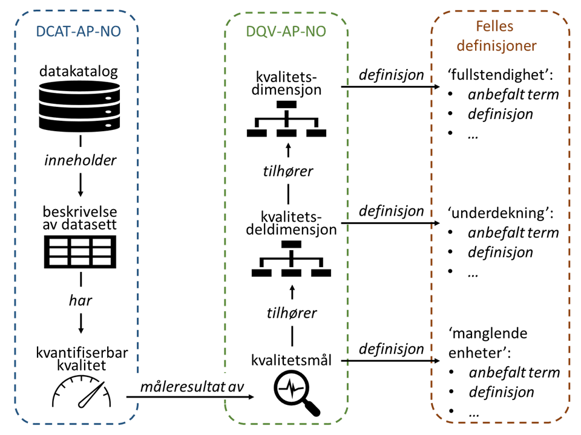

== Innledning

=== Formål, omfang og avgrensninger

Formålet med dette dokumentet er å gi veiledning i felles definisjoner på og måleverktøy for kvantifiserbar kvalitet på datasett. Et felles sett med definisjoner og måleverktøy vil skape en unison beskrivelse og forståelse av datakvalitet på tvers av virksomheter. Hensikten er ikke å utelukke andre måter å beskrive datakvalitet på enn disse presentert i dette dokumentet. Man står fritt til å supplere med andre typer kvalitetsmål i kvalitetsbeskrivelsen.

I henhold til https://data.norge.no/specification/spesifikasjon-for-beskrivelse-av-kvalitet-pa-datasett/[Spesifikasjon for beskrivelse av kvalitet på datasett], er det flere ulike måter å beskrive kvalitet på et datasett på:

* kvantifiserbar kvalitet
* ikke-kvantifiserbar kvalitet
* kvalitet i samsvar med gitt(e) standard(er)/spesifikasjon(er)
* brukertilbakemeldinger knyttet til kvalitet

Spesifikasjonen foreslo også å predefinere kvalitetsdimensjoner, kvalitetsdeldimensjoner og kvalitetsmål. Disse er publisert som egne kontrollerte vokabularer, ett for https://data.norge.no/vocabulary/quality-dimension[kvalitets(del)dimensjoner] og ett for https://data.norge.no/vocabulary/quality-metric[kvalitetsmål]. 

Dette er ikke en veileder for datakvalitetsarbeidet generelt. Veilederen forklarer hvordan datakvalitet beskrives, med fokus på å bruke predefinerte kvantifiserbare kvalitetsmål. Ved behov vil det bli utarbeidet tilsvarende veiledere for de andre måter å beskrive kvalitet på. Disse vil inngå i https://www.digdir.no/3626[Rammeverk for informasjonsforvaltning].

=== Målgruppe

Målgruppen for veilederen er:

* de som skal beskrive datasett og derunder kvantifiserbar kvalitet på datasett (primær målgruppe)
* de som leverer løsninger og verktøy for registrering og visning av denne type kvalitetsmål (primær målgruppe)
* de som skal forstå beskrivelse av kvantifiserbar kvalitet på datasett (sekundær målgruppe)

=== Sammenheng mellom relevante standarder, spesifikasjoner og denne veilederen

Veilederen må ses i sammenheng med  https://data.norge.no/specification/dqv-ap-no[DQV-AP-NO (Norsk applikasjonsprofil av DQV)].

Tegningen ovenfor illustrerer sammenhengen mellom ulike standarder/spesifikasjoner og felles definisjoner:

* https://data.norge.no/specification/dcat-ap-no/[DCAT-AP-NO - Standard for beskrivelse av datasett, datatjenester og datakataloger]: Denne spesifiserer bl.a. hvordan datasett beskrives, deriblant hvordan en beskrivelse av kvantifiserbar kvalitet knyttes til beskrivelsen av et datasett.

* https://data.norge.no/specification/dqv-ap-no[DQV-AP-NO - Norsk applikasjonsprofil av DQV]: Denne spesifiserer hvordan kvalitet på datasett beskrives, bl.a. å knytte kvalitetsbeskrivelse til kvalitetsdimensjon.

* Felles definisjoner: Hensikten med felles definisjoner er å skape et felles vokabular for kvalitetsbeskrivelse, slik at beskrivelsene forstås likt. Dette handler om felles definisjoner og forståelse av kvalitetsdimensjoner og kvalitetsdeldimensjoner, og også kvalitetsmål når det gjelder kvantifiserbar kvalitet.

Denne veilederen forklarer predefinerte kvalitetsmål for kvantifiserbar kvalitet, samt de kvalitetsdeldimensjonene og kvalitetsdimensjonene disse kvalitetsmålene tilhører.
